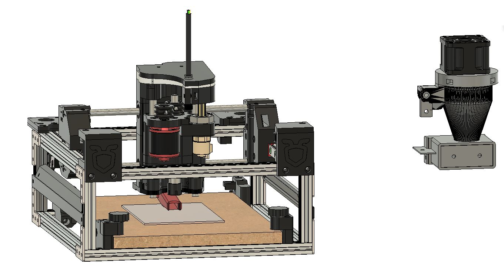

# ANT-PCB-Maker-AddOns-Public (work in progress)

Add-On's related to the ANT PCB Maker -> Credits goes to the ANT Team developed all the nice stuff:
https://bitbucket.org/compactpcbmaker/cpcbm/src/master/

Additional credits to "Nanocube" as I added a remix of his "Small cyclone dust buster for Small CNC machines":
https://www.thingiverse.com/thing:3961313

And final credits to "Andrew Harpur" as I used a few items out of his 20x20mm frame disign:
https://gallery.autodesk.com/fusion360/projects/139459/the-ant-pcb-router-20x20mm-frame

  
Depending on the original files/project below license notes:

NOTE: All the files and informations in the mechanics folder of this repository are licensed under CC-BY-NC-SA license.
Please, refer to the following link to know the details about this license.

Creative Commons Attribution-NonCommercial-ShareAlike 4.0 International License
http://creativecommons.org/licenses/by-nc-sa/4.0/
