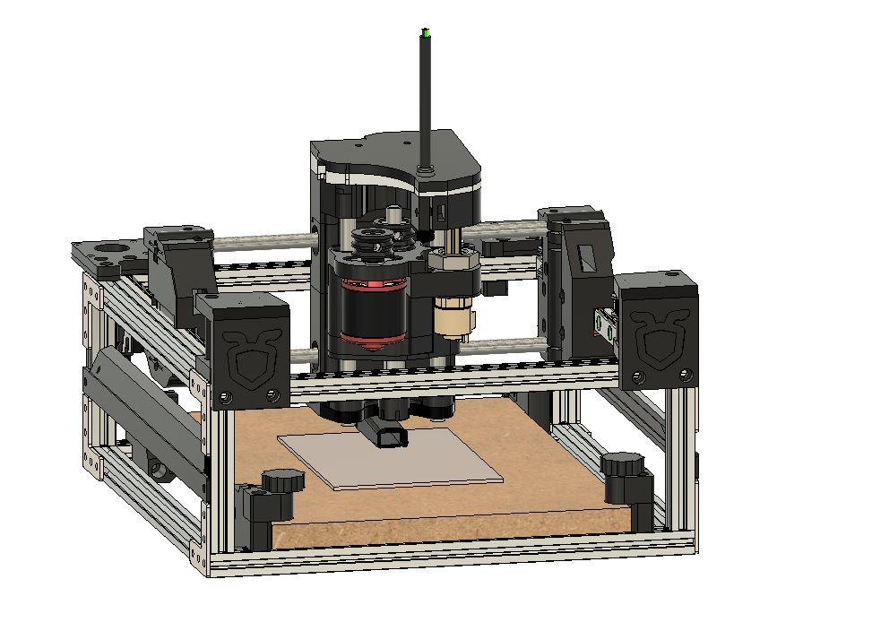
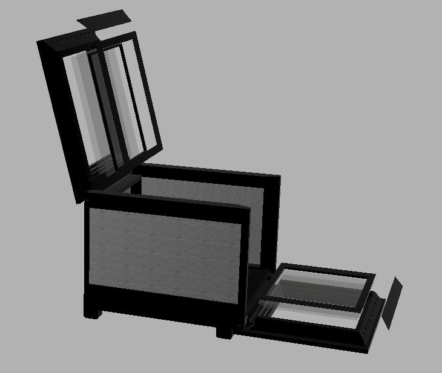
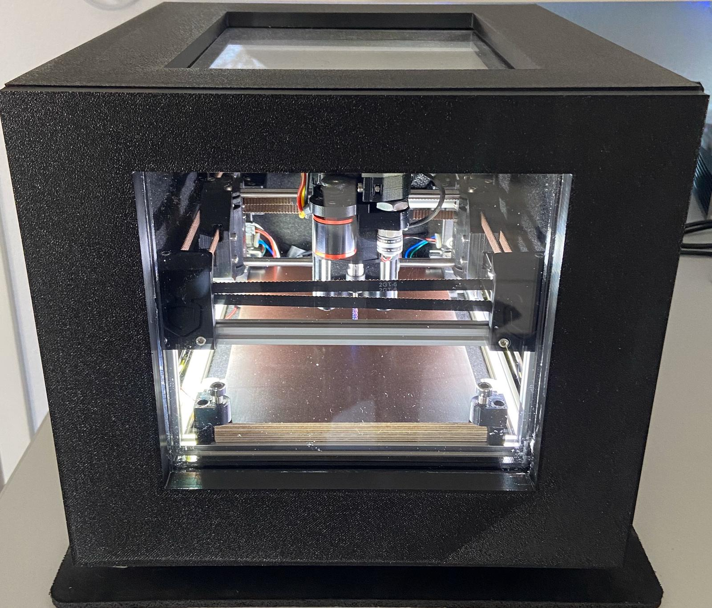
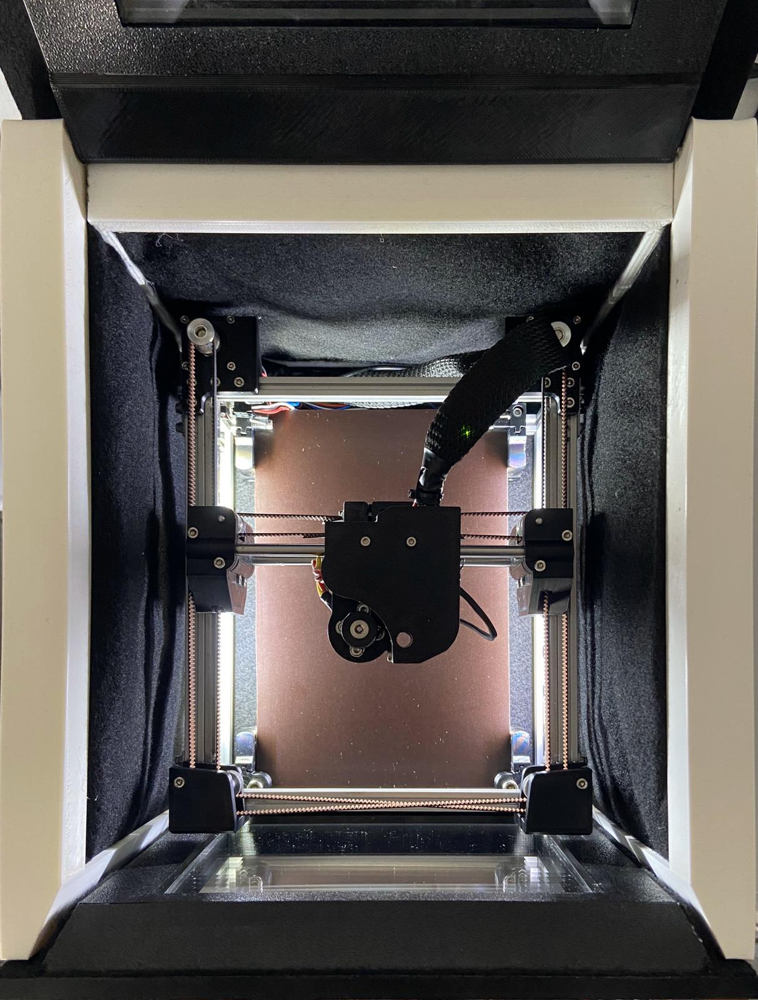
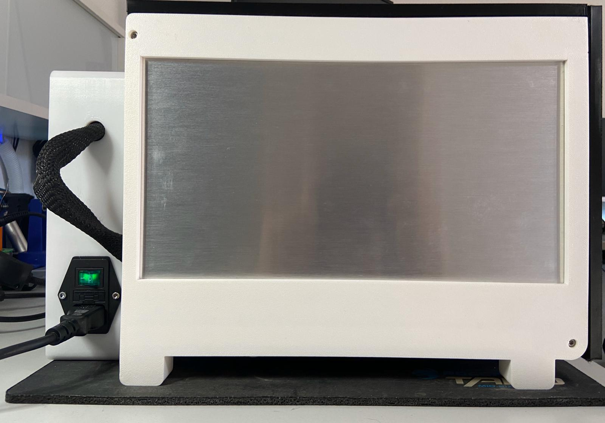

# ANT-PCB-Maker-AddOns-Public (Completed)

# The ANT Cave

# The ANT is alive and placed in the cave

## Credits:
Add-On's related to the ANT PCB Maker -> Credits goes to the ANT Team developed all the nice stuff:
https://bitbucket.org/compactpcbmaker/cpcbm/src/master/
Follow on Instagram: https://www.instagram.com/the_ant_team/

"Andrew Harpur" as I added a few items out of his 20x20mm frame design:
https://gallery.autodesk.com/fusion360/projects/139459/the-ant-pcb-router-20x20mm-frame

"Carl Shelton" remixed the LED side panels from Thingiverse:
https://www.thingiverse.com/thing:3715382

## License:  
Depending on the original files/project below license notes:

NOTE: All the files and informations in the mechanics folder of this repository are licensed under CC-BY-NC-SA license.
Please, refer to the following link to know the details about this license.

Creative Commons Attribution-NonCommercial-ShareAlike 4.0 International License
http://creativecommons.org/licenses/by-nc-sa/4.0/

## Contribution:
Feel free to contribute and send a pull request to get your changes included into the cad .step file

## The Ant cave:
* Keeps the ANT quiet ( 1M / < 38db) Will ensure you ANT will not escape... 
* Glass wool and fabric is keeping the ANT quiet
* double glass layer
* seperated electronics case 

## Changes/Add-On's:
* Printed parts re-designed (less support / ABS schrinking included & minor changes)
* LED side bars added
* WS2812b LED ligtning head insert including cable management
* New head cover
* Redesigned pulley's and motor mount (new o-rings needed 21.95mm x 1.78mm)
* Bridge rod admission changes
* Pulley idler changed (no need fo washers & locking nuts)
* Dust collector (Still missing Vacuum cleaner)